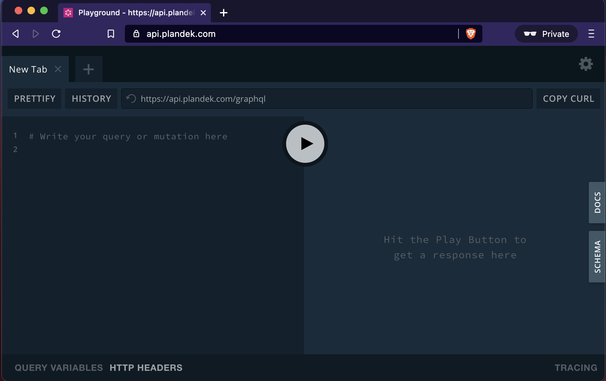
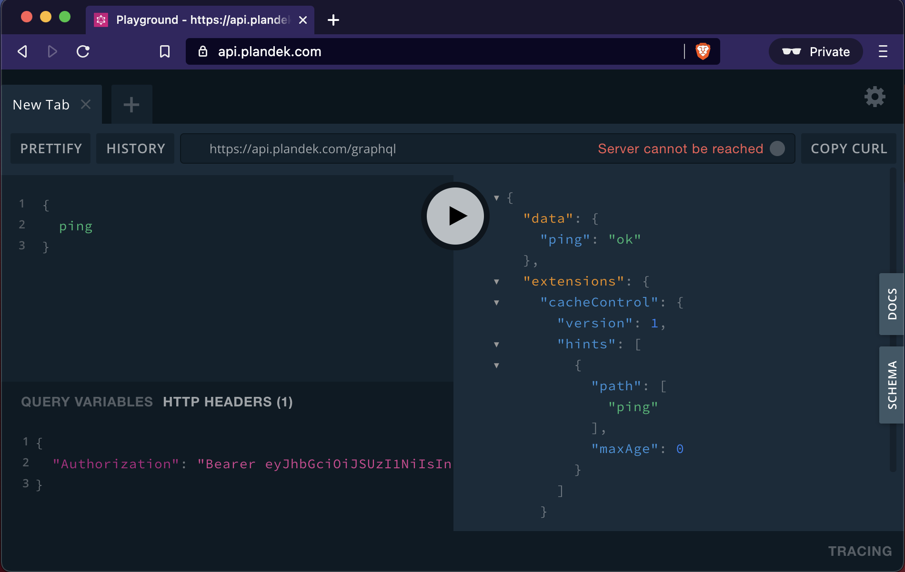
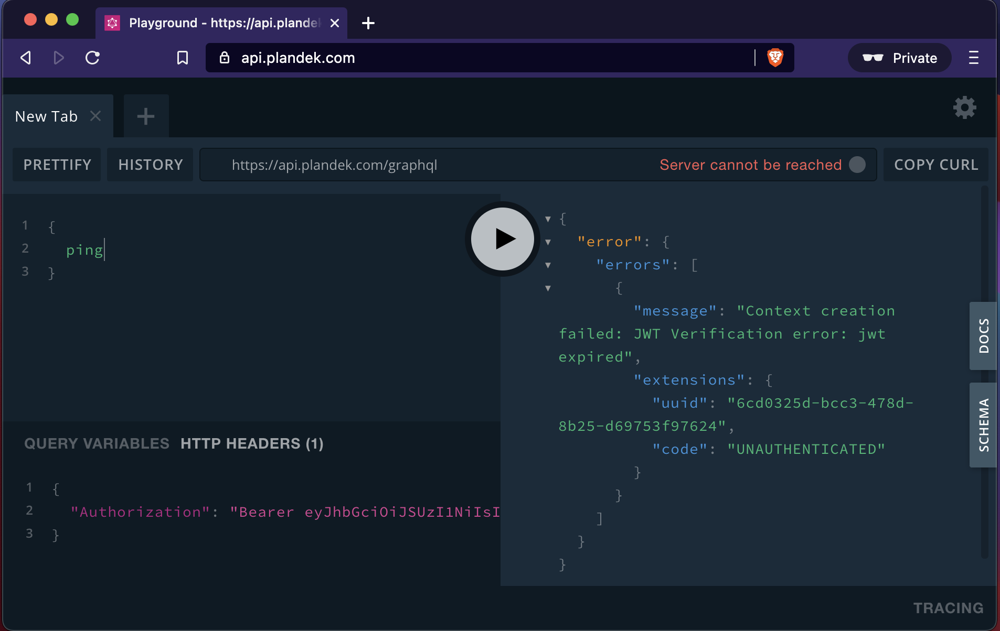
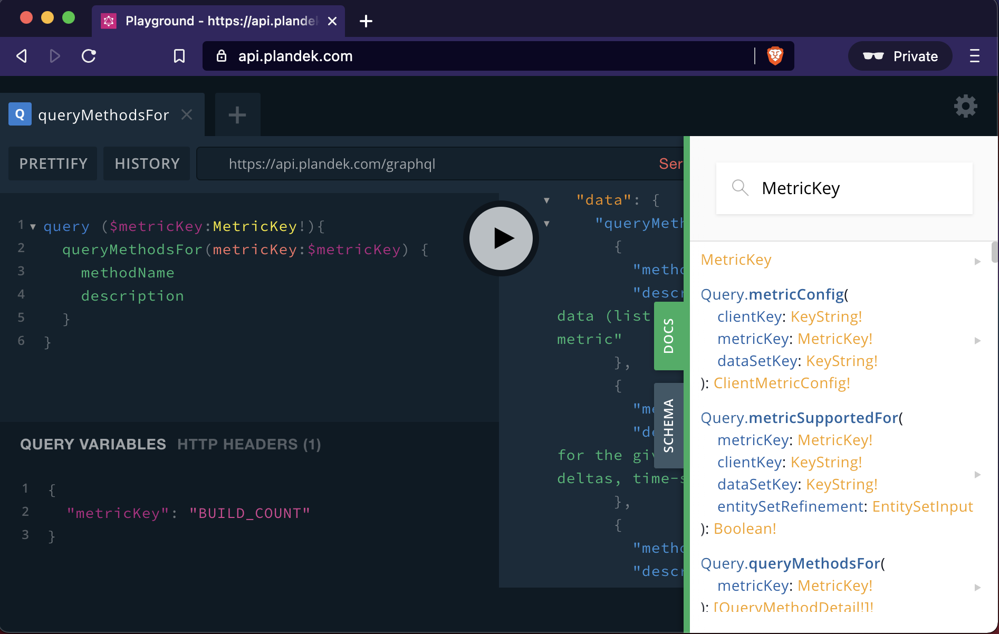
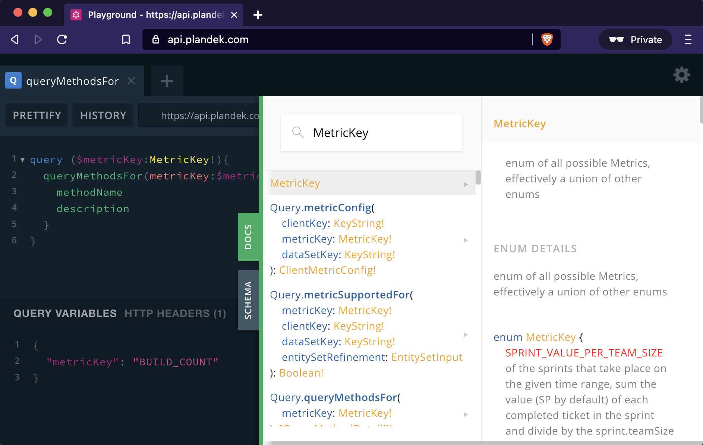

# Use GraphQL Playground

Visiting https://api.plandek.com in your browser will open the GraphQL Playground. [This post in LogRocket](https://blog.logrocket.com/complete-guide-to-graphql-playground/) explains how to use it.



## Auth

First, we need a JWT Access Token. We can get it by [following the instructions here](./m2m.md). 

We need to open the "HTTP HEADERS" and add a JSON with the relevant header. In our case it will be:

```json
{
  "Authentication": "Bearer <THE_ACCESS_TOKEN>"
}
```

We can make a simple `ping` query to check that it works ok.



If the token is expired, the api will tell us so.



## Explore the API

Now that we have it working, we can start exploring the API.

### Using the DOCS panel: `MetricKey`

Opening the 'DOCS' sidebar we can see an interactive schema. Searching for "MetricKey" we'll see the definition of the  `MetricKey` enum.



We can click con `MetricKey` to see the definition in the expanded panel.



The `MetricKey` define each available metric in Plandek API.

### Running query with Variables: `QueryMethodsFor`

Once knowing which MetricKey we want to explore, we can make a query to `queryMethodsFor` to get the list of queries that are relevant for that metric.

Go here for [an example of `QueryMethodsFor`](./query-methods-for.md)
